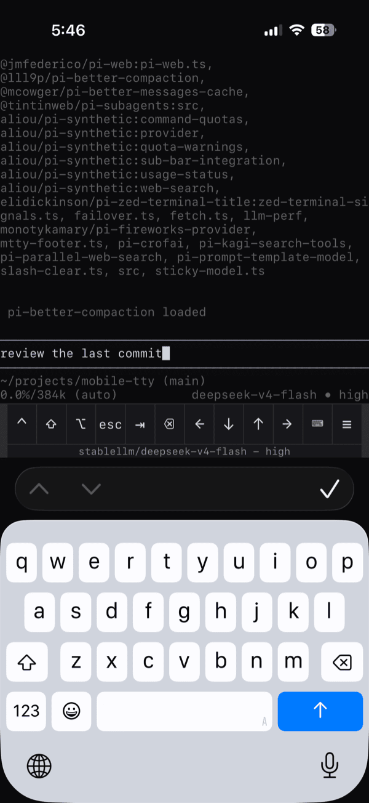
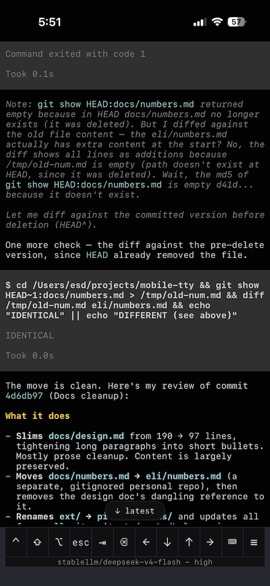

# mobile-tty

Access your Pi coding agent (with *all* the features) from a mobile device. Uses a WebSocket-attached PTY to show your whole terminal rather than replacing it with a web chat UI. Should work with many other full-screen TUI apps too.


<p>
  
    &nbsp;
  
</p>

## How it works

One Node process is the whole app. It runs pi on a real terminal (a PTY), and every viewer -- phone, desktop tab, `attach` -- is a WebSocket client watching that one stream. The grid is one size for everyone: the narrowest viewer's, because a real terminal can only be one width.

The server also feeds every byte into a second, headless terminal (`server/mirror.js`). That copy does two jobs: a joining viewer is handed a snapshot of it instead of making pi redraw (joining costs one screen, not the transcript), and it survives disconnects -- close the tab, reopen, the screen is back instantly.

The phone renders to the DOM, so the terminal's own scrollback is real history: scrolling, selection and find are the browser's, not reimplemented.

### Limitations

- **One program at a time.** Switching to a different pi session ends it. The conversation survives, but it won't keep working in the background. If you need two sessions going at once, you should run two instances of mobile-tty.
- **No alt-screen apps** (Claude Code, vim). The renderer ignores the alternate screen so scrollback stays real history; apps that switch to it can't render.
- **Reconnecting gets you the last ~1000 lines of scrollback.** The browser core's scrollback is hard-capped at 1000 lines (inside its WASM, not easy to change), so the snapshot matches it. Enough for a few turns back; a long session's history is gone after a reload.
- **The input box is pi's**, costing 5-6 rows; a client-side composer box would be better in some ways but would break pi's autocomplete.
- **iPhone/Safari only**; Android untested.

## Get Started

```
git clone https://github.com/elidickinson/mobile-tty && cd mobile-tty
npm install
./mobile-tty
```

That serves `pi` on http://127.0.0.1:7681. Open it on this machine -- that's your regular pi session in a browser, and every browser tab that opens the URL sees the same session. The server holds the screen across disconnects, so reopening the page gets it back instantly and closing the tab ends nothing. `Ctrl-C` in the serving terminal ends it all. Keystrokes typed while briefly disconnected queue up and replay.

**Then the phone**, which needs a way to reach the machine. On the same wifi:

```
export MTTY_PASSWORD=...    # the page becomes a login
./mobile-tty --lan          # listen on the LAN address
```

and open `http://<your computer's address>:7681` on the phone. From anywhere instead of just home, run it through a Cloudflare tunnel -- see [Reach it from anywhere](#reach-it-from-anywhere). Either way, on the phone: **Add to Home Screen** (standalone mode is worth ~7 rows over Safari).

Optional: install pi extension to print the model at the bottom of the screen (otherwise it is obscured on a narrow phone screen). The extension is only active when pi is run through mobile-tty.
```
pi install "$PWD/pi-extensions/mtty-footer.ts"
```

**Other ways to run it:**

```
./mobile-tty serve bash             # a program other than pi
./mobile-tty pi --model whatever    # arguments after the program go to it
./mobile-tty attach                 # watch the same session from a second terminal (Ctrl-] detaches)
./mobile-tty --port 1234            # --bind and --hostname too
./mobile-tty serve --tunnel         # run the tunnel alongside; needs setup first (below)
```

**Only tested on an iPhone** (Safari, and the e2e suite runs WebKit). Android is untested -- reports welcome. Requires node 22+, plus `cloudflared` for the tunnel. macOS gets a prebuilt `node-pty`; on Linux `npm install` compiles it, which wants python and a C++ toolchain. Alt-screen apps (Claude Code, vim) are out of scope.

## The phone UI

- **Key bar**: `⌃ ⇧ ⌥` are sticky (tap, then the next key carries them -- so `⌃ c` = Ctrl-C). Then `esc`, `⇥`, `⌫`, arrows, `⌨` (toggle keyboard), `≡` (menu). Backspace and arrows repeat when held.
- **Status strip** (if the optional extension is installed): model and thinking level (`provider/model - max`), which pi's footer truncates at phone width.
- **Scrolling**: drag. Away from the bottom, output is *held* rather than drawn, so the page under you never moves; the **↓ N new** button counts what is waiting. Tapping it or typing releases it.
- **Landscape** reflows to full width automatically.
- **Menu** (`≡`): folder switching, Top/Bottom, Paste, grid presets and Fit, zoom (render only), Reconnect, Clear view (local), Reload app, Diagnostics. ⚡ means the socket is down.

## Switching folders

The `≡` menu lists folders that have had a pi session in them, newest first. Tap one for **Start here** (fresh session) or **Continue here** (resume that folder's most recent session). To add a folder to the list, run pi in it once, from any terminal -- it shows up at the top.

Switching **ends the running program**, and picking a folder is itself the confirmation -- there is no accidental switch. Every viewer follows, and a turn in flight dies with it, but the conversation is safe: pi writes it down as it goes, and **Continue here** picks it back up.

## Reach it from anywhere

Pick one auth method, not both.

**Cloudflare Access** (recommended, internet-facing). Given a domain on Cloudflare:

```
cloudflared tunnel login                 # once
./mobile-tty setup pi.example.com        # tunnel, DNS, config, Access login
./mobile-tty serve --tunnel --hostname pi.example.com
```

The server runs with no password here; Access authenticates at the edge, and `setup` verifies a login is really in place.

**`$MTTY_PASSWORD`** (LAN/tailnet): the page becomes a login that mints a cookie; `attach` uses the same password. A single static secret over plain http -- fine on a network you trust.

**`--hostname` is required behind any proxy.** Any web page you visit can open a WebSocket to your loopback, so a socket is refused unless its `Origin` matches where it connected. IPs work as-is; names must be declared via flag or `$MTTY_HOSTNAME`. Miss it and the page loads but never connects (reason on stderr).

Desktop can join too (same URL or `./mobile-tty attach`). One PTY means one size, and **the narrowest viewer wins** -- a phone-width column on desktop is legible; the reverse is not. The server reports the size it picked.

## Advanced

- The flags also read env vars: `$MTTY_PORT`, `$MTTY_BIND`, `$MTTY_HOSTNAME` (and `$MTTY_PASSWORD`, above).
- The folder menu is built from pi's history under `~/.pi/agent/sessions`; `$PI_CODING_AGENT_SESSION_DIR` points it elsewhere.
- **Continue here** always takes the folder's *most recent* session. To reach a different one in the same folder, continue, then `/resume` inside pi.
- Restarting the server starts a fresh pi. `./mobile-tty pi --session-id whatever` pins one to come back to.
- No terminal handy to seed a new folder? `./mobile-tty serve bash`, then cd and run pi once.

## Development

No build step: the client is bundled per page request, so client edits need a reload, not a restart. Server edits need a restart, which kills the program.

```
npm test                # unit, including the snapshot round-trip gate
npm run typecheck       # strict tsc over the vendored wterm renderer
npm run test:e2e        # WebKit at 402x812 against tests/fixtures/fake-pi.js
npm run test:integrity  # that no viewer is ever sent a gap
npm run test:smoke      # against real pi; sends no prompts, costs no tokens
npm run test:real-pi    # real pi behind the real server, resized mid-draw
```

## Architecture

One node process owns everything. `server/` spawns the program on a real PTY through `node-pty` and every viewer -- phone, desktop tab, `attach` -- is a WebSocket client of it, speaking a protocol of five byte-tagged frames (`server/protocol.js`) that the client parses in about thirty lines.

- **`server/mirror.js`** feeds every output byte into an `@xterm/headless` terminal and serializes it on demand. A joining viewer is handed that snapshot instead of making pi redraw -- a join costs the screen, not the transcript -- and it is what survives a disconnect.
- **`server/index.js`** is the hub: one grid for all viewers (narrowest wins), fan-out, and folder switching, which respawns the program against a list `server/places.js` built (`server/auth.js` and `origin.js` guard the door; `footer.js` relays the status strip).
- **`server/client.js`** builds the client with esbuild *inside the request* -- JS, CSS and the VT core's WASM inlined into one HTML document, hashed into its own ETag. One file is one thing for the phone's cache to get right, and a document built from disk on demand cannot be stale.
- **`src/app.js`** is the client. `@wterm/dom` -- vendored under `vendor/wterm`, see `docs/plan-ios-input.md` -- renders the terminal into the DOM, so native momentum scroll, selection and find come free and the terminal's own scrollback is the history -- no copy-mode, no alternate screen. The vendored copy is TypeScript imported straight into the bundle, which is why the esbuild build passes `tsconfig.json` and `npm run typecheck` covers it; `@wterm/core`, the WASM VT engine it renders with, stays a pinned npm dependency. Around it: `viewport.js` sizes the grid from `visualViewport` (the keyboard never reflows pi), `ttyd.js` and `transport.js` are the wire, `keys.js` encodes the bar keys.

Why it's built this way: [`docs/design.md`](docs/design.md).
